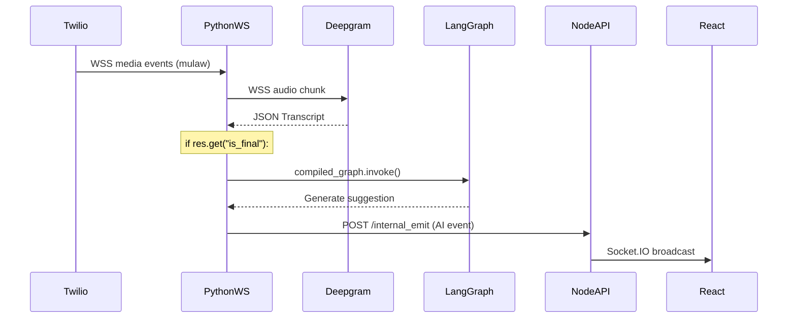
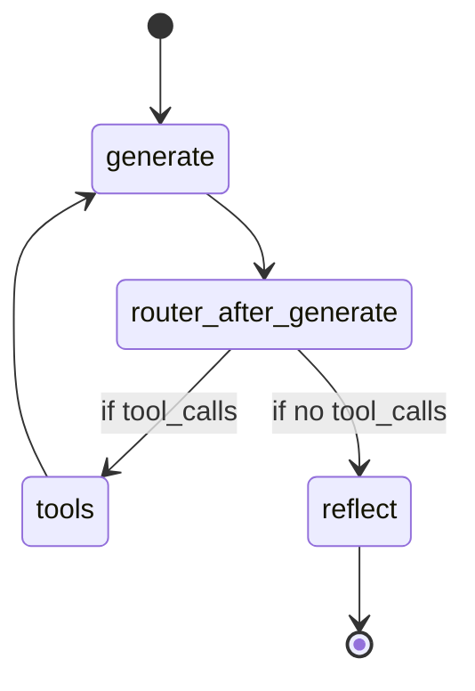
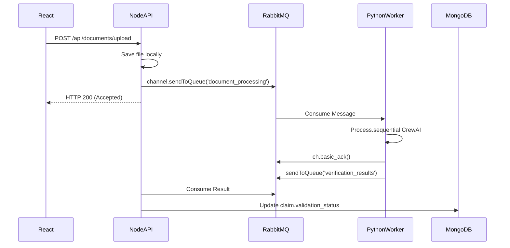
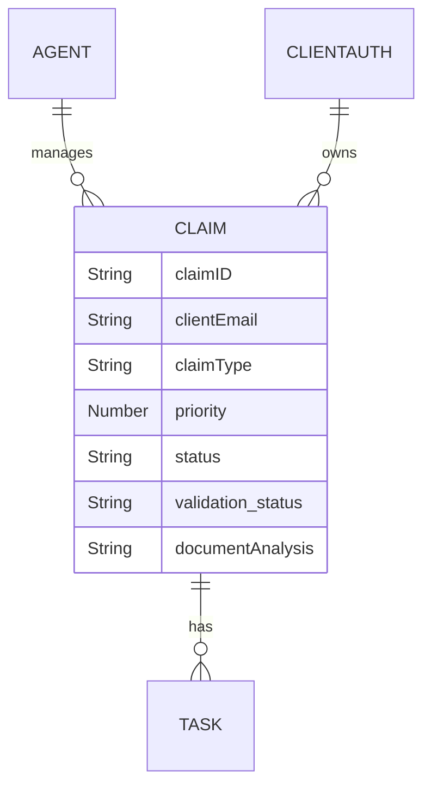

# EyHacks SAKSHAM AI Claims Processing System

A streaming telephony ingestion and AI-assisted supervisor workflow that couples explicit LangGraph processing with asynchronous multi-agent document analysis.

## 2. Engineering Problem

This architecture addresses several integration and decoupling challenges:
- **Receiving continuous telephony audio**: Ingesting inbound audio as a continuous stream from Twilio Media Streams rather than waiting for call completion.
- **Transcribing telephony-compatible audio**: Forwarding `mulaw` audio directly to streaming Speech-to-Text (Deepgram).
- **Processing conversational context**: Turning final caller transcripts into actionable input for an AI workflow (LangGraph) with model-driven tool routing.
- **Synchronizing live events**: Bridging Python-generated AI events and transcripts to a React-based human-facing dashboard via Socket.IO.
- **Decoupling heavy machine learning**: Keeping long-running, sequential multi-agent document analysis outside the latency-sensitive HTTP request path by relying on asynchronous queueing.

## 3. System at a Glance

| Area | Implementation Evidence |
| :--- | :--- |
| **Voice ingress** | Twilio Media Streams to Python WebSocket server |
| **Conversation orchestration**| LangGraph with model-driven tool routing |
| **Dashboard synchronization** | Node.js `/internal_emit` webhook triggering Socket.IO broadcasts |
| **Document processing** | CrewAI sequential multi-agent workflow |
| **Persistence** | MongoDB (Mongoose ODM) |
| **Rate limiting** | `express-rate-limit` backed by Redis |
| **Task queue** | RabbitMQ (durable queues, non-persistent messages) |
| **Deployment** | Docker Compose with local `cloudflared` tunneling |

## 4. High-Level Architecture

```mermaid
flowchart TD
    %% Telephony Ingestion Path
    Caller[Phone Caller] -->|PSTN| Twilio[Twilio Webhook]
    Twilio -->|Inbound Media Stream| PythonWS[Python Voice WebSocket]
    PythonWS -->|Audio Bytes| Deepgram[Deepgram STT]
    Deepgram -->|Final Transcript| PythonWS
    PythonWS -->|compiled_graph.invoke| LangGraph[LangGraph Engine]
    
    %% Dashboard Synchronization Path
    LangGraph -->|AI Event / Suggestion| InternalEmit[/Node /internal_emit]
    InternalEmit -->|Socket.IO| React[React Dashboard]
    
    %% Document Processing Path
    React -->|Upload| NodeAPI[Node.js Express API]
    NodeAPI -->|Publish Task| RabbitMQ[(RabbitMQ)]
    RabbitMQ -->|Consume Task| PythonWorker[Python Worker Process]
    PythonWorker -->|Process.sequential| CrewAI[CrewAI Workflow]
    CrewAI -->|Result Publication| NodeAPI
    
    %% Database and Cache
    NodeAPI -->|CRUD| Mongo[(MongoDB)]
    PythonWorker -->|Update Claim| Mongo
    NodeAPI -->|Rate Limiting| Redis[(Redis)]
```

*Note: Redis is connected only to the Node.js API for rate limiting and is not currently configured as a Socket.IO adapter.*

## 5. Runtime Process Boundaries

* **Node.js Express API (`backend-node`)**: 
  - **Responsibility**: Manages standard HTTP endpoints, MongoDB reads/writes, JWT validation, RabbitMQ publishing, and Socket.IO broadcasts.
  - **State Owned**: HTTP sessions, Socket.IO connections.
  - **Why the boundary exists**: Isolates network-bound I/O and web server operations from CPU-heavy ML tasks.
* **Python Voice/WebSocket Process (`realtime-voice`)**: 
  - **Responsibility**: Terminates inbound Twilio Media Streams, handles Deepgram STT bridging, executes local HuggingFace sentiment analysis, and traverses the LangGraph state machine.
  - **State Owned**: Process-global `conversation_history` and `audio_queue`.
  - **Why the boundary exists**: Keeps heavy Python ML dependencies and stateful voice streams separate from the Node.js event loop.
* **Python RabbitMQ Worker (`python-worker`)**: 
  - **Responsibility**: Consumes document verification tasks, executes sequential CrewAI agents, and updates MongoDB.
  - **Why the boundary exists**: Offloads long-running, CPU-bound ML work from both the voice process and the Node API.
* **React Frontend**: Client-side UI managing dashboard state via Zustand.
* **MongoDB**: Persistent data store.
* **Redis**: Rate-limiting backing store.
* **RabbitMQ**: Asynchronous task decoupling buffer.

## 6. Voice Ingestion Pipeline — Exact Execution Trace

The exact executable path for an incoming call:

1. Twilio hits the Node `/twilio/voice` HTTP webhook.
2. Node returns TwiML with `<Connect><Stream url="..."/></Connect>`.
3. Twilio initiates a WebSocket connection to `twilio_ws_handler` in the Python service.
4. Python receives `"media"` events and forwards base64 decoded `mulaw` bytes to the Deepgram WSS URL.
5. `receive_from_deepgram` yields messages.
6. The code filters transcripts via `if res.get("is_final"):`.
7. Final transcripts are appended to history and passed to `process_conversation`.
8. `compiled_graph.invoke` evaluates the LangGraph nodes.
9. An AI response or suggestion is generated.
10. Python executes `requests.post('http://127.0.0.1:5000/internal_emit')`.
11. Node.js processes the internal HTTP POST and calls `socketio.emit`.
12. React dashboard receives the event and updates the UI.



### What This Pipeline Does Not Currently Do

- **It is not a bidirectional voice agent**: There is no Text-to-Speech (TTS) stage wired into the active call path.
- **Callers do not hear the AI**: No AI-generated audio is sent as `"media"` back to Twilio.
- **Partial transcripts are not processed**: The code explicitly waits for Deepgram's end-of-speech detection (`is_final`).

## 7. LangGraph Runtime Architecture

The AI conversational workflow uses an explicit LangGraph topology.



* **Explicit Topology**: The graph structure is explicitly defined via `StateGraph(AgentState)` with concrete nodes (`generate`, `tools`, `reflect`).
* **Model-Driven Runtime Routing**: The execution path is not strictly deterministic. The `router_after_generate` function examines `last_message.tool_calls`. Because the LLM dynamically decides whether to issue a tool call, the runtime route selection is inherently non-deterministic.
* **Context Truncation**: Before invoking the model, the conversation history is aggressively truncated (`list(messages)[-6:]`) to control token consumption and manage API rate limits.

## 8. Tool Calling

The LangGraph `tool_node` provides schema-described tool calling.

* **`query_claim_status(claim_id)`**: Queries MongoDB directly to retrieve a claim's real-time status, type, and priority.
* **`search_policy_vectors(query)`**: Queries a local FAISS index containing pre-computed policy embeddings.
* **`schedule_task(title, description, due_date, client_email)`**: Posts a JSON payload to the Node API `/api/tasks` endpoint, generating a new scheduled task and broadcasting a Socket.IO event.

The tool definitions use standard typed signatures, prompting the LLM to emit compatible JSON arguments. Failure within a tool generally returns an error string directly into the LangGraph state context.

## 9. LLM Retry and Rate-Limit Handling

Groq's API strictly enforces rate limits (Tokens Per Minute). The `safe_chat_invoke` wrapper handles 429 errors.

**Execution Trace**:
1. Try `chat.invoke(messages)`.
2. Catch Exception. Check if error string contains "rate_limit" or "429".
3. Wait initial delay (`delay = 3` seconds).
4. Exponential backoff (`delay *= 2`).
5. Max retries (5 iterations).
6. If retries exhaust, `process_conversation` catches the final exception and falls back to emitting a static error string (`"⚠️ BPO Suggestion Draft: [Suggestion currently unavailable...]"`).

## 10. Dashboard Synchronization

The Python Voice Server cannot emit Socket.IO directly to the frontend because Node.js owns the Socket.IO server.

**Trace**: Python AI Event -> `requests.post('http://.../internal_emit')` -> Node.js Express handler -> `io.emit('event', data)` -> React listener.

* **Security Gap**: The `/internal_emit` webhook in Node.js currently lacks internal authentication (e.g., mTLS, pre-shared key).
* **Socket.IO Scaling**: Node.js currently uses the default in-process Socket.IO adapter. Multiple Node instances would not automatically share Socket.IO broadcasts without introducing a distributed adapter like Redis.

## 11. Document Processing Architecture

Long-running CrewAI document analysis is decoupled from the HTTP request path.



By placing RabbitMQ in between, the Node.js API immediately responds to the client upload. RabbitMQ decouples CrewAI execution from the Node.js HTTP request path and Node process.

## 12. CrewAI Multi-Agent Workflow

The `document_crew.py` script orchestrates three specialized agents:

1. **OCR and Data Extraction Specialist**: Reads PyTesseract/PyPDF2 text and extracts structured entities.
2. **Fraud Detection Analyst**: Consumes the extracted entities to check for logical inconsistencies.
3. **Policy Alignment Agent**: Assesses the fraud report and entities to make a final Approved/Rejected decision.

**Execution Mode**: `Process.sequential`. The agents execute one after another in a linear pipeline. The application does not parallelize their execution.

## 13. RabbitMQ Delivery Semantics

The system utilizes RabbitMQ primarily for **asynchronous workload decoupling**. The system does not provide exactly-once or uniform at-least-once processing semantics. A worker crash before ACK can cause redelivery, while handled application exceptions are ACKed in the finally path and discarded. Non-persistent queued messages are also not guaranteed to survive broker restart.

* **queue durability**: `true`. The queues themselves survive a broker restart.
* **message persistence**: Messages are not explicitly published with `delivery_mode: 2` or `persistent: true`.
* **auto_ack**: `false` (via library defaults). Manual acknowledgment (`basic_ack`) is used.
* **prefetch_count**: `1` (ensures the Python worker only accepts one active CrewAI job at a time).
* **requeue behavior**: The Python worker acknowledges messages (`basic_ack`) inside a `finally` block even if an exception occurs, meaning failed tasks are discarded rather than requeued.

**Failure Matrix**:
| Scenario | Current Behavior | Risk |
| :--- | :--- | :--- |
| Worker crashes (OOM/Segfault) before ACK | TCP connection drops. RabbitMQ re-delivers message to another worker. | Task is processed twice. |
| Handled CrewAI Python exception | Worker catches exception, logs it, and `basic_ack`s the message. | Document is never processed; task is lost. |
| RabbitMQ broker restarts | Durable queue survives. | Non-persistent messages are not guaranteed to survive a RabbitMQ broker restart. |

## 14. Persistence Model

The system uses Mongoose (ODM) to interact with MongoDB.



CrewAI eventually mutates the `validation_status` and `documentAnalysis` fields on the `Claim` document based on its findings.

## 15. Authentication and Authorization

* **JWT Handling**: `bcryptjs` for password hashing, JWTs issued and verified in `httpOnly` cookies.
* **Role Separation**: Enforced via distinct middleware: `protectRoute` (for BPO agents) and `protectClientRoute` (for clients).
* **Onboarding**: A plaintext generated password is created via `crypto.randomBytes()` when a client submits their first claim, and is emailed directly to them.

**Security Gaps**:
* The `/internal_emit` API route lacks authentication.
* Twilio webhook signature validation is absent.
* Auto-generated plaintext passwords sent via email should ideally mandate a password rotation upon first login.

## 16. Redis and Rate Limiting

Redis is actively used as the backing store for `express-rate-limit`.

**Execution**: `connectRedis()` -> `new RedisStore()` -> `app.use("/api/", limiter)`. The limiter enforces a strict 500 requests per 15-minute window per IP.

Redis is **not** currently configured as the Socket.IO adapter. Because Socket.IO uses the default in-process adapter, horizontally scaling the Node.js API to multiple instances would break real-time frontend event broadcasting for users connected to different nodes.

## 17. Scheduled Claim Assignment

The `backend/src/index.js` file registers a scheduled callback using `node-cron` (`*/1 * * * *`). 

This callback executes inside the main Node.js process and initiates an asynchronous HTTP `POST` to `/api/claims/assign`. It does **not** spawn a separate OS thread, `worker_thread`, or child process.

## 18. Auto-Tunnel Development Automation

The `auto_tunnel.py` script is developer tooling designed to bypass local NAT/Firewall restrictions. It detects/downloads the Cloudflare `cloudflared` binary, launches it as a subprocess, regex-extracts the dynamic HTTPS URL from `stdout`, mutates the `.env` file, and issues a REST call to the Twilio API to update the phone number's webhook routing.

## 19. State Ownership and Concurrency

| State | Owner | Persistence | Scope | Concurrency Risk |
| :--- | :--- | :--- | :--- | :--- |
| **Claim State** | MongoDB | Disk | Global | Application-dependent; document-level persistence does not provide task idempotency or workflow-level stale-update protection. |
| **LangGraph Context** | Python `LLM.py` | Memory | Process-Global | High |
| **Socket.IO Clients**| Node.js | Memory | Process-Local | High (Breaks on multi-node) |
| **RabbitMQ Tasks** | RabbitMQ | Memory | Broker-Global | Medium (Non-persistent messages) |

**The Process-Global Conversation History Flaw**:
In `backend/python/LLM.py`, `conversation_history` is declared as a module-global list. It is not keyed by a Twilio `CallSid` or Stream ID.
If Call A and Call B occur simultaneously, Call A's Deepgram final transcript will append to `conversation_history`, and Call B's final transcript will append to the exact same list. LangGraph will evaluate an interleaved context containing utterances from completely distinct phone calls. The Python WebSocket server allows concurrent connections to access the same process-global conversation history.

## 20. Failure Model

| Scenario | Detection | Current Response | Persistent State Impact |
| :--- | :--- | :--- | :--- |
| **Deepgram Disconnect** | `try/except` in WS task | Logs error, stops streaming audio | None |
| **Groq 429 Limit** | `safe_chat_invoke` catch | Exponential backoff up to 5 times | AI event delayed |
| **Groq Retries Exhaust** | `safe_chat_invoke` catch | Returns static error string to frontend | Fallback text emitted |
| **RabbitMQ Restart** | Connection failure | Non-persistent messages are dropped | In-flight tasks lost |
| **Worker Handled Exception** | Python `try/except` | Logs error, ACKs message to queue | Task discarded |
| **Simultaneous Phone Calls** | None (Architectural Flaw) | Mutates global history array | Cross-call context corruption |

## 21. Performance and Cost Model

* **Network-Bound Work**: Twilio WSS ingestion, Deepgram STT bridging, Groq API invocations, MongoDB CRUD, internal HTTP emissions.
* **Local Process-Isolated Work**: HuggingFace sentiment analysis pipeline, LangGraph state traversal, PyTesseract OCR.
* **Asynchronous Queue Work**: CrewAI sequential execution.

## 22. Complexity and Throughput Constraints

**Verified execution shape**: the repository contains manual single-call E2E tooling; no formal concurrent-call capacity test or load test is present.

**Known Code-Derived Bottlenecks**:
* Code-derived concurrency limitation: process-global `conversation_history` does not provide session isolation across simultaneous calls.
* Groq TPM (Tokens Per Minute) limits constrain the conversational cadence.
* `prefetch_count=1` limits the Python worker to a single active CrewAI document verification at a time.
* The default Socket.IO adapter limits the Node API to a single process.

**Potential Scale-Out Directions** (Proposed, not implemented):
* Keying voice state by `StreamSid`.
* Adding `@socket.io/redis-adapter` for multi-node Node API deployments.
* Publishing RabbitMQ messages with `persistent: true` for true durability.
* Implementing DLQ (Dead Letter Queue) topologies for failed CrewAI jobs.

## 23. Testing and Verification

The repository relies on a manual E2E test script (`trigger_call.py`) to verify Twilio connectivity. There is currently no verified automated test suite (no unit tests, integration tests, or latency benchmark instrumentation).

## 24. Engineering Trade-offs

| Current Choice | Behavioral Benefit | Cost / Limitation |
| :--- | :--- | :--- |
| **Twilio Media Streams over TwiML** | Streams raw audio immediately instead of waiting for a completed recording. | Requires maintaining a complex, stateful WebSocket connection for raw `mulaw` audio. |
| **LangGraph over Direct LLM API** | Explicit nodes provide structured tool execution paths. | Runtime routing is strictly model-driven, making testing complex. |
| **RabbitMQ for Document AI** | Decouples long-running CrewAI execution from the HTTP request path. | Introduces broker infrastructure overhead and requires careful ACK management. |
| **Process-Global Conversation State** | Simple to implement for single-caller demonstrations. | Does not provide conversation-state isolation across concurrent calls. |
| **Non-Persistent RMQ Messages** | Faster broker memory throughput. | Non-persistent messages are not guaranteed to survive a RabbitMQ broker restart. |

## 25. Security Gaps

Based on executable evidence, the current vulnerabilities are prioritized as:
* **P0**: The `/internal_emit` Node API lacks internal authentication, allowing arbitrary internal/external network callers (if exposed) to trigger Socket.IO events.
* **P0**: Process-global `conversation_history` allows distinct phone calls to leak PII into each other's LangGraph contexts.
* **P1**: Auto-generated plaintext passwords sent via email do not mandate a forced reset upon first login.
* **P1**: Twilio webhook signatures are not validated, meaning anyone can simulate a call to the webhook.

## 26. Technical Debt and Roadmap

**P0 (Immediate Architecture Fixes)**:
- Isolate voice state per `StreamSid` / connection in `LLM.py`.
- Secure `/internal_emit` via pre-shared key or mTLS.

**P1 (Resilience & Semantics)**:
- Explicitly mark RabbitMQ task messages as persistent.
- Change Python worker error handling to NACK failed CrewAI tasks into a DLQ instead of ACKing them.
- Validate Twilio webhook signatures.

**P2 (Scalability & Validation)**:
- Configure Redis as a distributed Socket.IO adapter to allow scaling the Node.js API horizontally.
- Implement formal test suites (Jest/PyTest).

## 27. How to Run Locally

### Prerequisites
* Docker & Docker Compose
* Node.js (v18+)
* Python 3.12+
* Twilio Account
* API Keys (Deepgram, Groq, Pinecone, Google)

### 1. Clone & Install
```bash
git clone <repository>
cd EyHacks
npm install
cd backend && npm install
```

### 2. Environment Variables
Create `.env` in the root directory:
```env
TWILIO_ACCOUNT_SID=
TWILIO_AUTH_TOKEN=
TWILIO_PHONE_NUMBER=
DEEPGRAM_API_KEY=
API_KEY=
JWT_SECRET=
SMTP_USER=
SMTP_PASS=
```

### 3. Run the Infrastructure
```bash
docker compose up -d
```

### 4. Run the Auto-Tunnel
*(Leave running in a separate terminal)*
```bash
python3.12 -m venv .venv
source .venv/bin/activate
pip install -r backend/python/requirements.txt
python3 auto_tunnel.py
```

### 5. Run the Frontend
```bash
npm run dev
```

## 28. Interview Summary

**30-Second Explanation**:
"I built a streaming telephony ingestion and document-analysis architecture for claims processing. Twilio Media Streams send raw inbound caller audio to a Python server where Deepgram creates final transcripts. These transcripts feed into an explicit LangGraph state machine, which synchronizes AI events and suggestions to a React dashboard via an internal Node.js event bridge. Separately, long-running CrewAI document analysis is decoupled from the HTTP path using RabbitMQ to prevent Node event-loop blocking."

**2-Minute Technical Explanation**:
"The architecture addresses two major decoupling challenges. First, receiving continuous telephony audio required shifting away from standard webhooks to raw Twilio WebSockets. By streaming the audio to Deepgram and feeding final transcripts into an explicit LangGraph workflow, I built an inbound pipeline that can evaluate context and push AI suggestions to a React supervisor dashboard via Node's Socket.IO server. Second, analyzing uploaded medical documents via CrewAI takes substantial time. I decoupled this entirely from the HTTP request path by publishing non-persistent RabbitMQ tasks, allowing the Node API to immediately respond to clients while isolated Python workers consume tasks and perform sequential multi-agent analysis asynchronously. I also implemented an exponential backoff wrapper in Python to handle stringent Groq API rate limits without dropping the active WebSocket connection."
